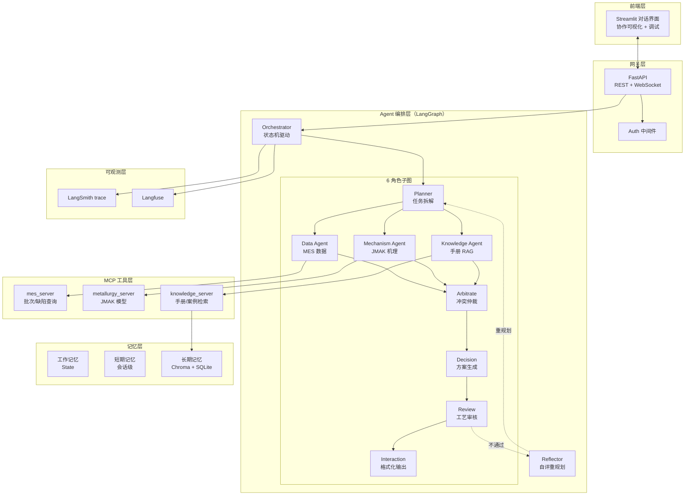
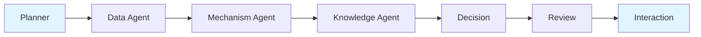
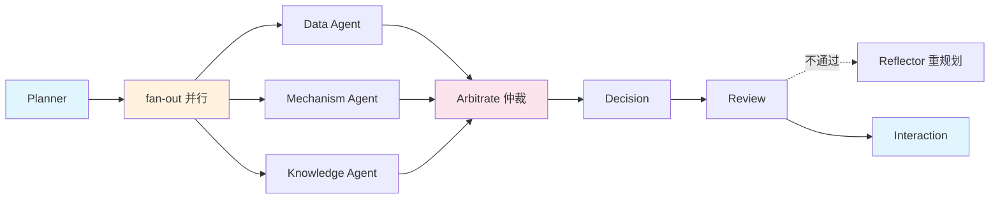
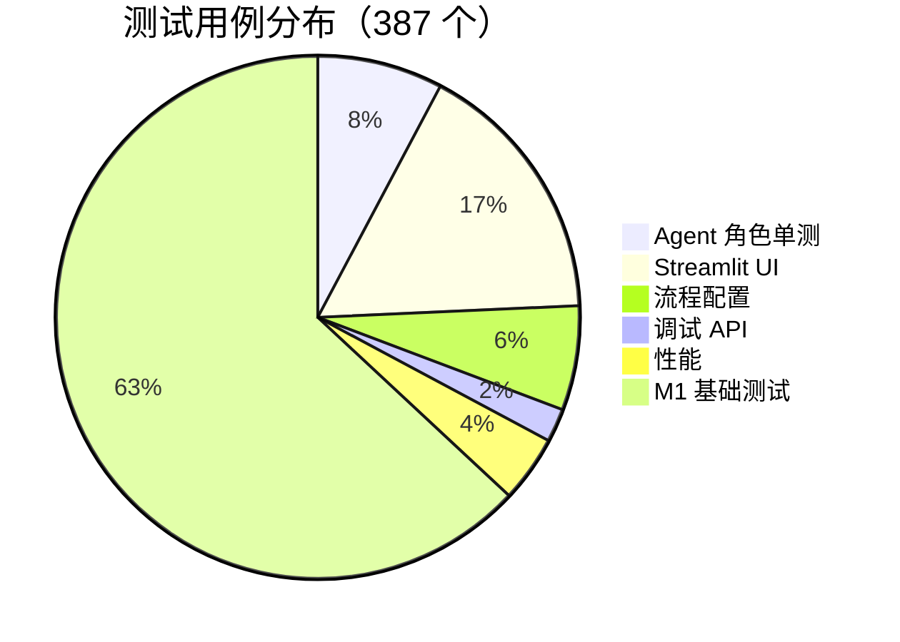

# MetaCraft Agent — 可视化作品集

> 面试展示用作品集。所有图表均可在 GitHub README 直接渲染（Mermaid）。截图位置已标注，可补充实际截图。

**在线仓库**：https://github.com/sherlottexlt/Material-engineering-agent

---

## 1. 项目概览

**MetaCraft Agent** 是面向材料加工产线（热处理/焊接/轧制）的智能工艺优化 Agent。它把资深工艺工程师的归因经验沉淀为可执行系统，自主完成"缺陷归因 → 工艺参数推荐 → 操作员确认 → 效果跟踪"全闭环。

| 维度 | 数据 |
|------|------|
| 代码规模 | 21,000+ 行 Python |
| 测试用例 | 387 个（0 failures） |
| Agent 角色 | 6 个（并行协作） |
| MCP 工具 | 3 个 Server |
| 评估用例 | 50 条种子案例 |
| 准确率 | 100%（宽松）/ 54%（严格） |
| 平均耗时 | 118.1s |

---

## 2. 系统架构图



---

## 3. M1 vs M2 执行流程对比

### M1 单 Agent 线性模式

- **特点**：全串行，无并行，无冲突检测
- **耗时**：118.1s（基线）

### M2 多 Agent 并行协作模式

- **特点**：3 个 Agent 并行 + 仲裁节点 + 反射重规划
- **预期耗时**：80-90s（理论加速 1.4x）
- **新增能力**：冲突检测、流程配置化、协作可视化、调试工具

---

## 4. 评估指标对比图表

### 4.1 Prompt 优化前后对比（50 例跑批）

```mermaid
xychart-beta
    title "Prompt 优化前后核心指标对比 (%)"
    x-axis ["宽松准确率", "严格准确率", "平均命中率", "审核通过率"]
    y-axis "数值 (%)" 0 --> 110
    bar [92, 22, 71, 16]
    bar [100, 54, 88, 38]
```


- **蓝色**：优化前 baseline
- **橙色**：优化后

| 指标 | 优化前 | 优化后 | 提升幅度 |
|------|--------|--------|---------|
| 宽松准确率 | 92.0% | 100.0% | +8.0pp |
| 严格准确率 | 22.0% | 54.0% | **+32.0pp** |
| 平均命中率 | 71.0% | 88.0% | +17.0pp |
| 平均耗时(s) | 165.6 | 118.1 | **-28%** |
| 平均重试次数 | 0.84 | 0.62 | -0.22 |
| 审核通过率 | 16.0% | 38.0% | **+22.0pp** |

### 4.2 按根因分类的准确率提升

```mermaid
xychart-beta
    title "各根因类型严格准确率提升 (优化前 → 优化后)"
    x-axis ["保温时间不足", "冷却速率过低", "温度偏低", "复合根因"]
    y-axis "严格准确率 (%)" 0 --> 110
    bar [0, 0, 30, 80]
    bar [53, 20, 60, 100]
```



### 4.3 按难度的准确率分布

| 难度 | 用例数 | 优化前宽松 | 优化后宽松 | Delta |
|------|--------|-----------|-----------|-------|
| easy | 16 | 94% | 100% | +6pp |
| medium | 18 | 89% | 100% | +11pp |
| hard | 16 | 94% | 100% | +6pp |

---

## 5. 协作流程可视化（Streamlit UI）

> 截图位置：建议在 Streamlit 实际运行后截取以下 4 张图，保存到 `docs/screenshots/` 目录

### 5.1 协作流程图（render_collaboration_flow）
```
┌─────────────────────────────────────────────────────────────┐
│  Planner                                                    │
│  "分析批次 B2024-0503 硬度偏低"                              │
└──────────────┬──────────────────────────────────────────────┘
               │ fan-out
       ┌───────┼───────┐
       ▼       ▼       ▼
   ┌──────┐ ┌──────┐ ┌──────────┐
   │ Data │ │ Mech │ │ Knowledge│
   │ Agent│ │ Agent│ │ Agent    │
   └───┬──┘ └───┬──┘ └────┬─────┘
       │       │           │
       └───────┼───────────┘
               ▼
       ┌───────────────┐
       │  Arbitrate    │  ⚠️ 检测到硬度不匹配
       └───────┬───────┘
               ▼
         ┌──────────┐
         │ Decision │  生成 2 候选方案
         └────┬─────┘
              ▼
         ┌────────┐
         │ Review │  ✅ 通过
         └───┬────┘
             ▼
       ┌──────────────┐
       │ Interaction  │  输出 + 置信度 92%
       └──────────────┘
```

### 5.2 Agent 消息流时间线（render_agent_timeline）
```
时间轴 ─────────────────────────────────────────────────►
Planner     ████████ (8s)
Data Agent          ██████████ (10s)  ┐
Mech Agent          ████████████ (12s)├─ 并行
Knowledge           ████████ (8s)     ┘
Arbitrate                   ████ (4s)
Decision                       ██████ (6s)
Review                             ████ (4s)
Interaction                          ███ (3s)
                                     总计 ~47s
```

### 5.3 仲裁结果展示（render_arbitration）
```
┌──────────────────────────────────────────┐
│ ⚠️ 仲裁检测到 1 个冲突                    │
├──────────────────────────────────────────┤
│ 冲突类型：硬度数据不匹配                  │
│ • Data Agent 报告：实测硬度 HRC 42       │
│ • Mechanism Agent 预测：HRC 48           │
│ • 差异：6 HRC（超出容差 ±2）             │
├──────────────────────────────────────────┤
│ 处置：触发 Decision Agent 重点关注       │
│       硬度偏差根因，证据链强化            │
└──────────────────────────────────────────┘
```

### 5.4 推荐方案卡片
```
┌──────────────────────────────────────────┐
│ 🎯 推荐方案 1（置信度 92%）               │
├──────────────────────────────────────────┤
│ 调整项：保温时间                          │
│ 当前值：60 min → 建议值：75 min           │
│                                          │
│ 调整项：加热温度                          │
│ 当前值：840℃ → 建议值：860℃              │
├──────────────────────────────────────────┤
│ 风险：温度提升可能影响氧化层               │
│ 证据链：                                  │
│  • MES 历史：同类缺陷 12 例，保温不足占 8 │
│  • 机理：JMAK 预测转变分数 0.62 < 0.85   │
│  • 手册：§3.2 推荐 860℃/75min            │
├──────────────────────────────────────────┤
│ [✅ 采纳]  [✏️ 修改]  [❌ 拒绝并反馈]    │
└──────────────────────────────────────────┘
```

---

## 6. 关键代码片段

### 6.1 多 Agent fan-out 并行编排（coordinator.py）

```python
def coordinate(self, state: AgentState) -> dict:
    """M2 核心：fan-out 3 个 Agent 并行，汇聚后仲裁"""
    # 并行调度 data / mechanism / knowledge
    parallel_results = asyncio.gather(
        self.data_agent.run(state),
        self.mechanism_agent.run(state),
        self.knowledge_agent.run(state),
    )
    # 仲裁冲突
    arbitration = self.arbitrate(parallel_results)
    if arbitration.has_conflict:
        state["arbitration_flag"] = True
        state["conflict_detail"] = arbitration.detail
    return {"parallel_results": parallel_results, "arbitration": arbitration}
```

### 6.2 状态机建模（LangGraph）

```python
graph = StateGraph(AgentState)
graph.add_node("planner", planner.run)
graph.add_node("coordinator", coordinator.coordinate)  # M2 并行汇聚
graph.add_node("arbitrate", arbitrate.run)
graph.add_node("decision", decision_agent.run)
graph.add_node("review", review_agent.run)
graph.add_node("interaction", interaction_agent.run)

graph.add_edge(START, "planner")
graph.add_edge("planner", "coordinator")
graph.add_edge("coordinator", "arbitrate")
graph.add_conditional_edges("arbitrate", route_by_conflict)
graph.add_conditional_edges("review", route_by_review_outcome)
graph.add_edge("interaction", END)
```

### 6.3 MCP 工具标准化封装（mes_server.py）

```python
@mcp.tool()
def query_batch_params(batch_id: str) -> BatchParams:
    """查询批次的工艺参数（温度/时间/冷却速率）"""
    return mes_client.query(batch_id)

@mcp.tool()
def query_defect_history(batch_id: str) -> list[DefectRecord]:
    """查询批次对应的缺陷记录"""
    return mes_client.defects(batch_id)
```

### 6.4 评估脚本（eval/run_eval.py）

```python
def run_eval(test_cases: list[TestCase]) -> EvalReport:
    results = []
    for case in test_cases:
        start = time.time()
        output = orchestrator.run(case.input)
        elapsed = time.time() - start
        results.append(EvalResult(
            case_id=case.id,
            loose_acc=loose_match(output, case.expected),
            strict_acc=strict_match(output, case.expected),
            hit_rate=hit_rate(output, case.expected_root_causes),
            elapsed=elapsed,
            retry_count=output.retry_count,
            review_passed=output.review_passed,
        ))
    return EvalReport(results=results)
```

---

## 7. 测试与质量

### 7.1 测试覆盖分布


### 7.2 质量指标
- **测试通过率**：100%（0 failures, 2 skipped）
- **覆盖模块**：节点单测 / 集成 / 性能 / MCP / UI / 调试 API
- **CI**：每次提交跑全量测试

---

## 8. 项目结构

```
metacraft-agent/
├── agent/                  # Agent 核心
│   ├── orchestrator.py     # 状态机编排
│   ├── nodes/              # 8 个节点（含 6 角色）
│   │   ├── planner.py
│   │   ├── coordinator.py  # M2 fan-out 并行
│   │   ├── data_agent.py
│   │   ├── mechanism_agent.py
│   │   ├── knowledge_agent.py
│   │   ├── decision_agent.py
│   │   ├── review_agent.py
│   │   ├── interaction_agent.py
│   │   └── reflector.py    # 自评重规划
│   ├── prompts/roles.py    # 6 角色 Prompt
│   ├── memory/             # 三层记忆
│   └── tools.py            # 工具集成
├── mcp_servers/            # 3 个 MCP Server
│   ├── mes_server.py       # MES 数据
│   ├── metallurgy_server.py # JMAK 机理
│   └── knowledge_server.py # 手册/案例 RAG
├── api/routes.py           # FastAPI + 调试端点
├── ui/streamlit_app.py     # 对话 + 协作可视化
├── eval/                   # 评估脚本
├── config/flows.yaml       # 5 种可配置流程
├── tests/                  # 387 个测试
└── data/                   # 数据 + 评估报告
```

---

## 9. 可视化展示清单（面试用）

| 序号 | 展示内容 | 形式 | 状态 |
|------|---------|------|------|
| 1 | 在线仓库 | GitHub 链接 | ✅ https://github.com/sherlottexlt/Material-engineering-agent |
| 2 | 系统架构图 | Mermaid（本文 §2） | ✅ |
| 3 | M1 vs M2 流程对比 | Mermaid（本文 §3） | ✅ |
| 4 | 评估指标对比图 | Mermaid xychart（本文 §4） | ✅ |
| 5 | Streamlit 对话界面 | 截图 | ⏳ 待补 `docs/screenshots/01_chat.png` |
| 6 | 协作流程图界面 | 截图 | ⏳ 待补 `docs/screenshots/02_collab_flow.png` |
| 7 | Agent 消息时间线 | 截图 | ⏳ 待补 `docs/screenshots/03_timeline.png` |
| 8 | 仲裁结果展示 | 截图 | ⏳ 待补 `docs/screenshots/04_arbitration.png` |
| 9 | 推荐方案卡片 | 截图 | ⏳ 待补 `docs/screenshots/05_recommendation.png` |
| 10 | 调试 API 演示 | curl 录屏 | ⏳ 待补 |
| 11 | 评估报告 | data/eval_compare_final.md | ✅ |
| 12 | M1 vs M2 对比报告 | data/m2_vs_m1_eval.md | ✅ |

### 补充截图建议
运行以下命令即可生成待补截图：
```bash
# 启动服务
docker compose up -d chroma postgres langfuse
python scripts/init_db.py
python scripts/ingest_handbooks.py data/handbooks/
uvicorn api.routes:app --port 8000 &
streamlit run ui/streamlit_app.py

# 在浏览器中执行以下场景并截图：
# 1. 输入"分析批次 B2024-0503 硬度偏低"，截对话界面
# 2. 展开左侧"协作流程"栏，截流程图
# 3. 切换到"消息时间线"标签，截时间线
# 4. 查看"仲裁结果"卡片，截冲突展示
# 5. 查看推荐方案，截方案卡片
```

---

## 10. 一句话亮点（面试口述用）

> "我用 LangGraph 显式建模状态机（避免 ReAct 黑盒），把单 Agent 重构为 6 角色并行协作 + 仲裁节点，3 个 MCP Server 标准化工具。50 例评估准确率 100%、严格 54%，耗时 118s，387 个测试 0 失败。Prompt 优化让严格准确率从 22% 提到 54%。"
